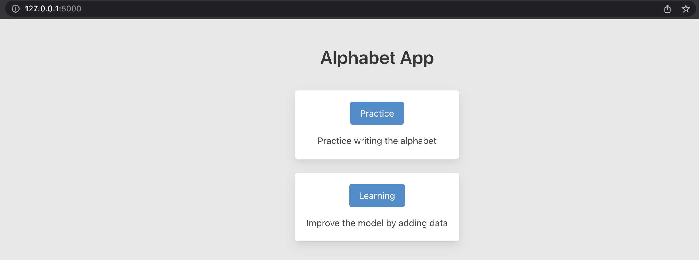
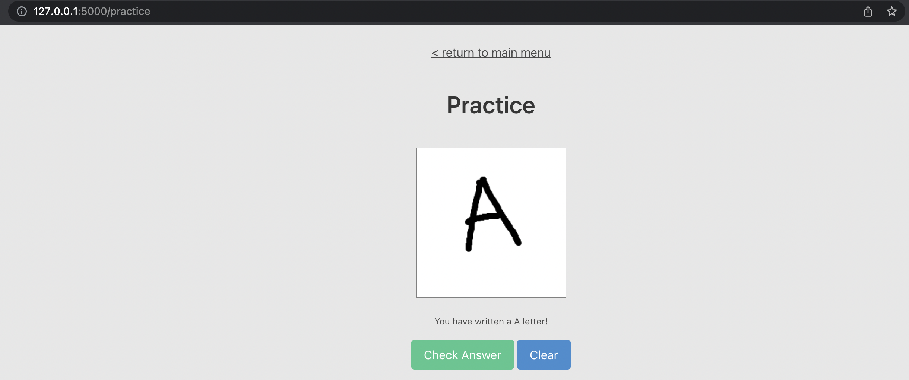

# Alphabet
A simple website to predict the letter from your handwriting.

## Tech stack
- HTML
- CSS/JavaScript
- Flask
- Tensorflow

## Usage
- Run the app from `app.py`

### 1. Learning & Training
- Data is stored in `./data/` under `.npy` format
- Use instructions in `./scripts/training.ipynb` to train
- Learning section allow user to add data as per requested by the app

### 2. Practice & Prediction
- User can draw letter to test the prediction capability of the app
